WebGL Forward+ and Clustered Deferred Shading
======================

**University of Pennsylvania, CIS 565: GPU Programming and Architecture, Project 5**

* Yinuo (Travis) Xie
  * [LinkedIn](https://www.linkedin.com/in/yinuotxie/)
* Tested on: **Google Chrom Version 118.0.5993.96 (Official Build) (arm64)** on
  Macbook Pro 14-inch, 2021, Apple M1 Pro, macOS Sonoma Version 14.0, 16GB RAM, 512GB SSD (Personal Laptop)

---
## Live Online

For some reason, I am not able to run the live demo. I am still trying to figure out the reason. I will update the link here once I figure it out. However, welcome to clone the repo and run it locally.

---

## Demo Video/GIF

You can find the demo video [here](https://youtu.be/ype4rfLFWNk).

---

## Project Overview

This project explores the implementation of two rendering pipelines in WebGL: Forward+ Rendering and Clustered Deferred Rendering. The core objective is to analyze and compare their performance to ascertain their suitability in different scenarios.

* **Forward+ Rendering** is an evolution of the traditional forward rendering, enhancing its efficiency and performance.
* **Clustered Deferred Rendering** leverages the clustered deferred shading algorithm for improved performance over traditional deferred shading.

---

## Forward+ Rendering

Forward+ Rendering ameliorates the traditional forward rendering pipeline by optimizing the light rendering process. Unlike the traditional approach where each light necessitates rendering the entire scene, Forward+ segregates the screen into tiles, assigning lights to specific tiles. Consequently, each tile only processes the lights affecting it, reducing the rendering load and enhancing performance.

---

### Example

Consider a scenario with a scene illuminated by 100 lights. In the conventional forward rendering approach, the scene undergoes rendering 100 times, once for every light. However, the Forward+ rendering methodology enhances efficiency by dividing the screen into 10 tiles, with each tile being responsible for 10 lights. As a result, the scene is rendered just 10 times, showcasing a notable improvement in rendering efficiency.

The image below, sourced from the [Forward vs Deferred vs Forward+ Rendering with DirectX 11](https://www.3dgep.com/forward-plus/) tutorial, demonstrates the optimization achieved in light rendering through the Forward+ technique. As illustrated, the scene is segmented into tiles, and a specific set of lights is designated to each tile. The rendering process ensues for each tile, utilizing only the lights associated with that particular tile. The Forward+ Lighting comparison reveals the Default Lighting (left) versus the Light heatmap (right), where the heatmap colors indicate the count of lights influencing a tile. Black tiles signify no light influence, blue tiles represent a light count ranging from 1 to 10, while green tiles denote a light range of 20 to 30.

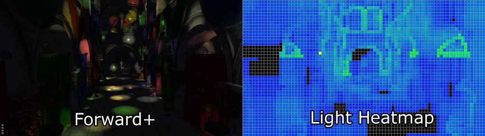

In this project, an adaptation of Forward+ rendering is employed, substituting tiles with clusters while preserving the core concept. The diagram above draws a clear distinction between the traditional forward rendering and Forward+ rendering, accentuating the optimized light management inherent in the latter approach.


---

### Clustered Shading

In this project, 'clusters' are employed as a substitute for 'tiles'. Clusters are 3D volumes that partition the scene into smaller, more manageable volumes. Each cluster maintains a list of lights affecting it. The rendering process is carried out for each cluster, utilizing only the lights relevant to that particular cluster. The table below showcases the difference between Tile Shading and Clustered Shading, as implemented in this project.

<div>
  <table>
    <caption>Comparison of Tile and Clustered Rendering Variations</caption>
    <tr>
      <td>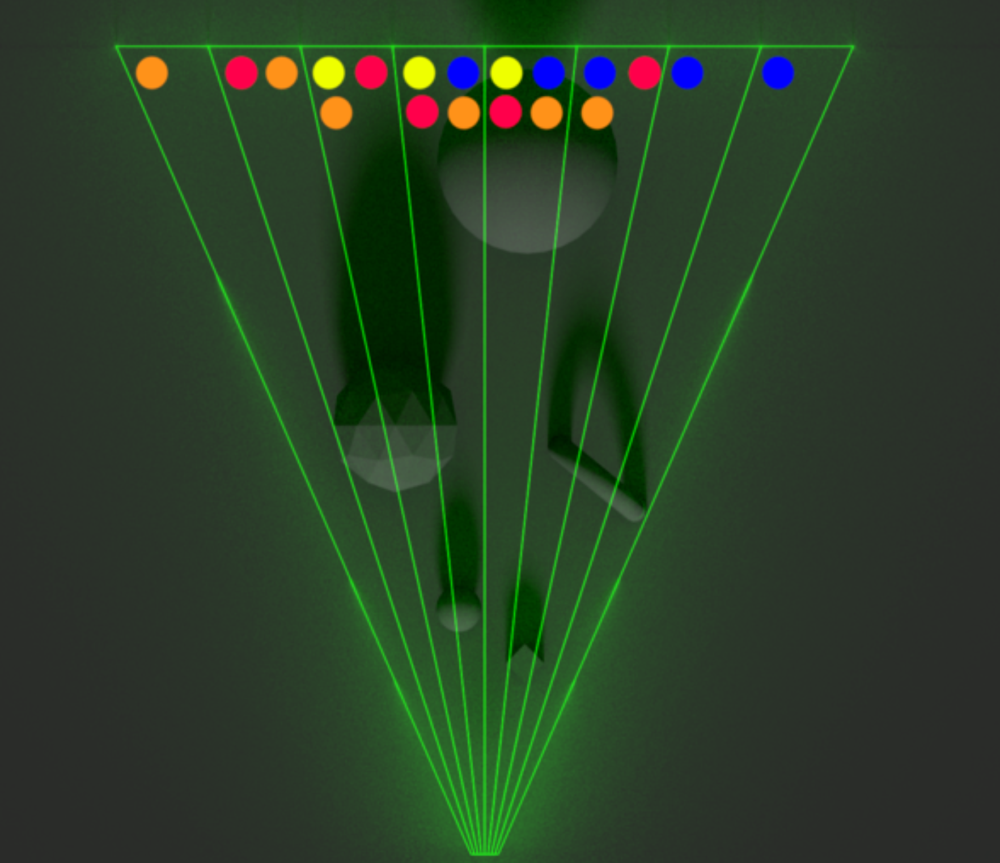</td>
      <td>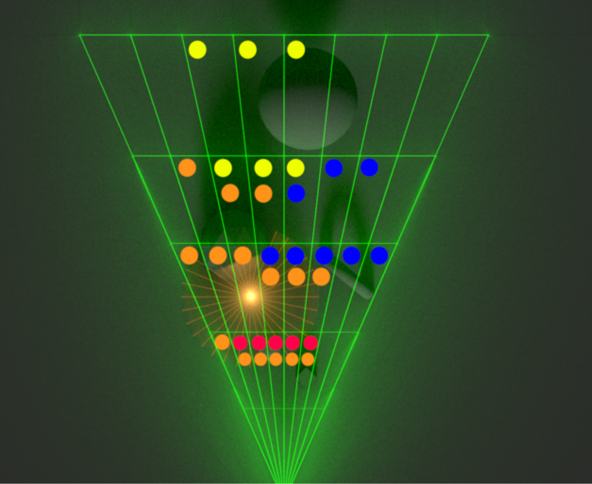</td>
    </tr>
    <tr>
      <td style="text-align:center;">Tile Shading</td>
      <td style="text-align:center;">Clustered Shading</td>
    </tr>
  </table>
</div>

For a deeper dive into the differences between clusters and tiles, refer to Ángel Ortiz's blog, [A Primer On Efficient Rendering Algorithms & Clustered Shading](http://www.aortiz.me/2018/12/21/CG.html#clustered-shading).

---

#### Benefits of Clusters over Tiles

Transitioning from tiles to clusters introduces several advantages aimed at boosting rendering performance and accuracy, particularly in 3D spaces. The key benefits include:

1. **Dimensionality**:
   * Clusters, operating in 3D space, capture the scene's depth, unlike 2D tiles. This volumetric partitioning fosters more accurate light-geometry interactions.

2. **Spatial Efficiency**:
   * Clusters dynamically adapt to the scene's complexity by encapsulating varying volumes of space, ensuring efficient processing of each scene section based on its content.

3. **Light Assignment Precision**:
   * Clusters assign lights to 3D volumes, refining light-scene interactions. In contrast, tiles might cause over or under-illumination due to their lack of depth information.

4. **Reduced Overdraw**:
   * Clusters mitigate overdraw—the rendering of pixels later overwritten—a common issue in 2D tiling, thereby improving rendering performance and lowering computational load.

5. **Better Handling of Complex Scenes**:
   * Clusters adeptly manage complex 3D scenes with numerous light sources and varied geometries, ensuring precise light distribution and rendering.

6. **Improved Performance**:
   * The minimized overdraw and precise light assignment to clusters bolster performance, rendering the process faster and more efficient compared to 2D tiling.

---

## Clustered Deferred Shading

Deferred Shading is a rendering technique designed to enhance performance by decoupling the shading and lighting calculations from the geometry computations. In contrast to the traditional forward rendering pipeline—where the scene is rendered iteratively for each light, leading to inefficiency—Deferred Shading streamlines the process. It initially renders the scene into a G-buffer, storing the geometry information of the scene. Subsequently, the scene is rendered again utilizing the G-buffer alongside the scene’s lights, which significantly reduces the number of renderings required and, consequently, boosts performance. The table below provides a visual representation of the various G-buffers utilized.

<div>
  <table class="g-buffer-table", align='center'>
    <caption style="font-weight:bold; font-size:1.2em;">G-Buffer Components</caption>
    <tr>
      <td>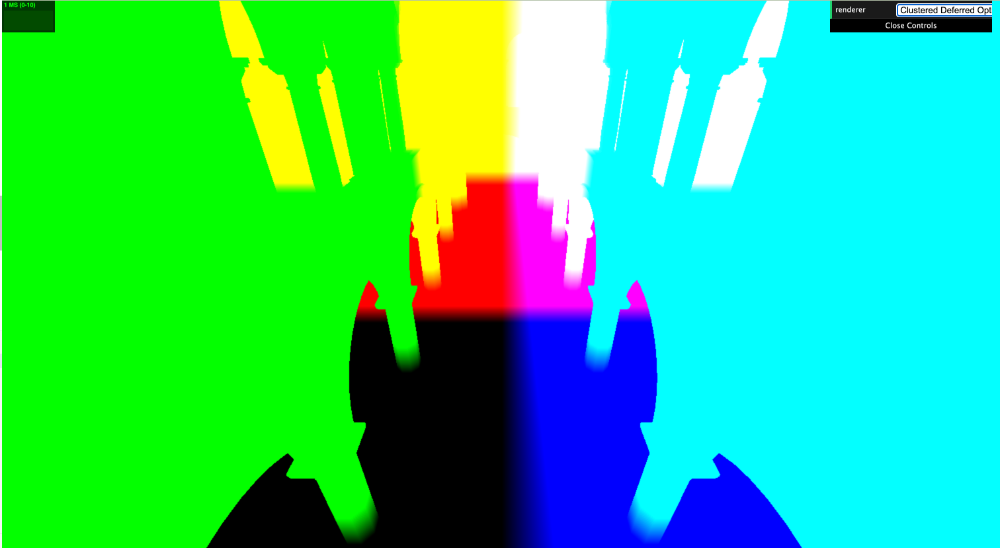</td>
      <td>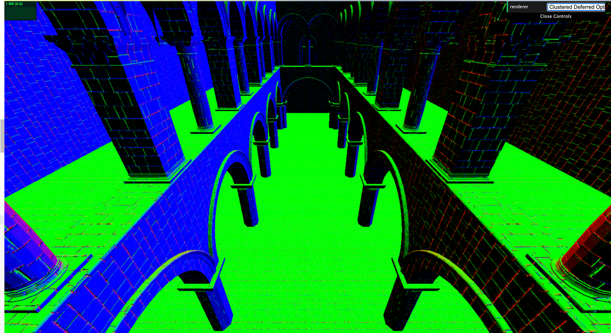</td>
    </tr>
    <tr>
      <td align='center'>Position</td>
      <td>Normal</td>
    </tr>
    <tr>
      <td align='center'>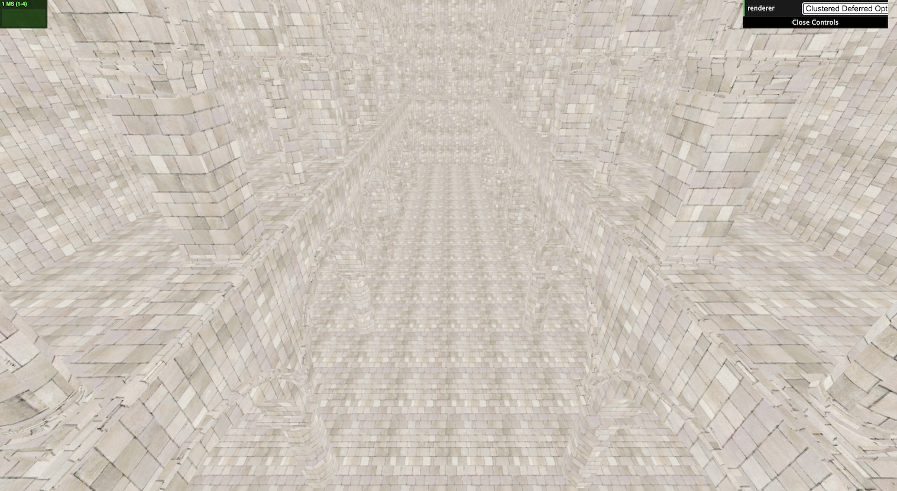</td>
      <td align='center'>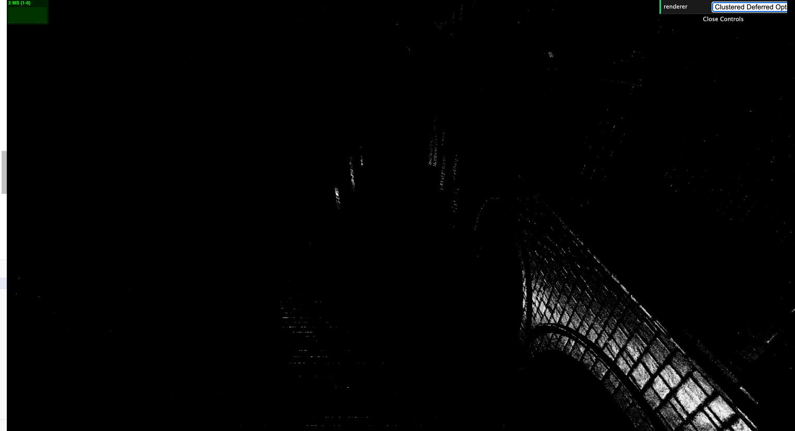</td>
    </tr>
    <tr>
      <td align='center'>Albedo</td>
      <td align='center'>Specular</td>
    </tr>
  </table>
</div>

---

#### G-Buffer Optimization

The G-buffer is integral to our rendering project, acting as a repository for the scene's geometric information. In our quest for efficiency, we've optimized the G-buffer by reducing its channel count from four to two. This has been accomplished by encoding the decoded normal within the alpha channel of both the position buffer and the albedo channel. Additionally, a noise function is applied to compute the specular term based on the position. The structure of our optimized G-buffer is outlined as follows:

* Position (x, y, z, normal.x)
* Albedo (r, g, b, normal.y)

**Octahedral Mapping**

Octahedral mapping is a celebrated technique in computer graphics, used for encoding 3D normal vectors into a 2D space. It projects the normal vector onto an octahedron and then unfolds it into a square, facilitating the storage of the data as a 2D texture. Our project leverages this technique to store only the x and y components of the normal vector, resulting in a more streamlined representation.

**Encoding**  
To encode a 3D normal vector \( \mathbf{n} = (n_x, n_y, n_z) \) into a 2D octahedral vector \( \mathbf{o} = (o_x, o_y) \), we use the following formula:
\[
\mathbf{o} = \left( \frac{n_x}{\lvert n_x \rvert + \lvert n_y \rvert + \lvert n_z \rvert}, \frac{n_y}{\lvert n_x \rvert + \lvert n_y \rvert + \lvert n_z \rvert} \right)
\]

Here’s how you can implement this in code:
```c++
vec2 EncodeNormal(vec3 n) {
    n /= (abs(n.x) + abs(n.y) + abs(n.z));
    n.xy = n.z >= 0.0 ? n.xy : ((1.0 - abs(n.yx)) * sign(n.xy));
    return n.xy * 0.5 + 0.5;
}
```

**Decoding**  
To decode a 2D octahedral vector \( \mathbf{o} = (o_x, o_y) \) back into a 3D normal vector \( \mathbf{n} = (n_x, n_y, n_z) \), you can use the following formula:
\[
\mathbf{n} = \left( o_x, o_y, 1 - \lvert o_x \rvert - \lvert o_y \rvert \right)
\]
\[
n_z = \frac{n_z}{\lvert n_x \rvert + \lvert n_y \rvert + \lvert n_z \rvert}
\]

Here’s the corresponding code implementation:
```c++
vec3 DecodeNormal(vec2 f) {
    f = f * 2.0 - 1.0;
    vec3 n;
    n.z = 1.0 - abs(f.x) - abs(f.y);
    n.xy = n.z >= 0.0 ? f.xy : ((1.0 - abs(f.yx)) * sign(f.xy));
    return normalize(n);
  }
```

**Trade-offs**

It is important to note that the use of encoding and decoding mechanisms introduces some loss of precision, which is evident when observing the accompanying graph. Despite this, we have deemed this compromise acceptable in order to achieve a reduction in the G-buffer size.

<div>
  <table class="g-buffer-table" align="center">
    <caption style="font-weight:bold; font-size:1.2em;">G-Buffer Components</caption>
    <tr>
      <td>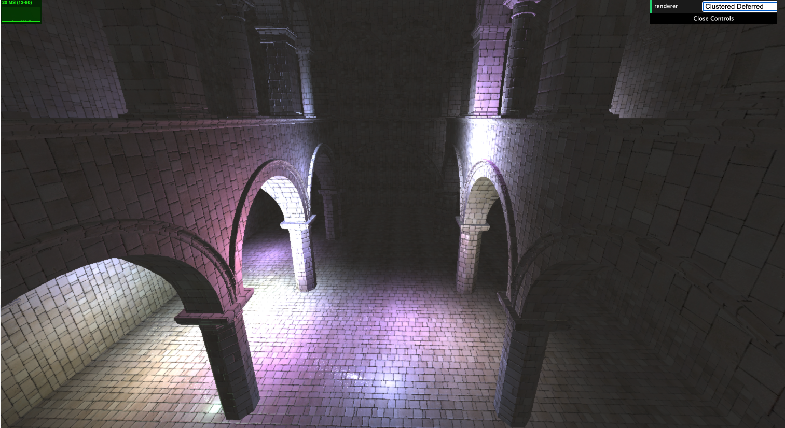</td>
      <td>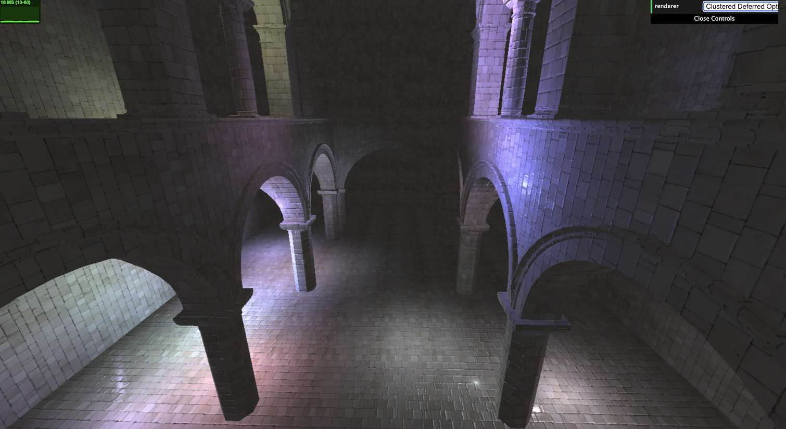</td>
    </tr>
    <tr>
      <td align='center'>Clustered Deferred Rendering</td>
      <td align='center'>Optimized Clustered Deferred Rendering</td>
    </tr>
  </table>
</div>

Upon examining the flooring, the distinction becomes clear: the optimized version exhibits a reduced level of detail. This serves as a tangible example of the aforementioned trade-off.

---

## Blinn-Phong Shading

To enhance the visual appeal of our project, we have implemented the Blinn-Phong shading model. This model contributes to the realistic rendering of surfaces by simulating the way light interacts with them.

The table below provides a visual comparison between the default shading model and the Blinn-Phong shading model:

<div>
  <table>
    <caption style="font-weight:bold; font-size:1.2em;">Shading Model Comparison</caption>
    <tr>
      <td></td>
      <td></td>
    </tr>
    <tr>
      <td style="text-align:center;">Default Shading</td>
      <td style="text-align:center;">Blinn-Phong Shading</td>
    </tr>
  </table>
</div>

The implementation of the Blinn-Phong shading model is encapsulated within the fragment shader. The corresponding code is showcased below:

```c++
// Blinn-Phong Shader Code
float lightDistance = distance(this_light.position, worldPos.xyz);
vec3 L = normalize(this_light.position - worldPos.xyz);
float lightIntensity = cubicGaussian(2.0 * lightDistance / this_light.radius);
float lambertTerm = max(dot(L, normal), 0.0);

vec3 H = normalize(L + viewDir);
specularTerm = pow(max(dot(normal, H), 0.0), shininess);

fragColor += (albedo * lambertTerm + vec3(specularTerm)) * this_light.color * vec3(lightIntensity);  
```

---

## Performance Analysis

To evaluate the efficiency of the various rendering pipelines, we conducted multiple performance analyses. These tests were executed under different light and cluster counts.

---

### Varying Light Counts

For this specific set of analyses, we maintained a constant cluster count of 15x15x15 and set the maximum number of lights per cluster to 1000. We then adjusted the total number of lights. The results are as follows:

<div align='center'>
  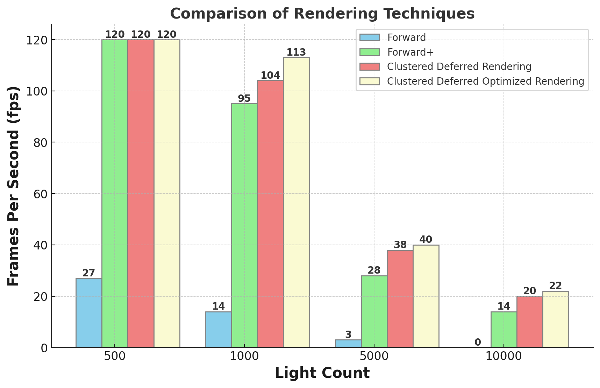
</div>

The graph illustrates the relationship between the number of lights and the frames per second (fps) achieved by each rendering technique. As observed:

* **Decline in Performance**: As the light count increases, every rendering technique exhibits a decrease in performance. However, the rate of decline varies.
* **Forward Rendering**: The traditional Forward Rendering experiences the most substantial drop, plummeting to 0 fps at 10,000 lights. This drastic reduction is because Forward Rendering processes each light source individually for every pixel, making it highly inefficient with an increase in the number of lights.
* **Comparison with Forward Rendering**: All other rendering techniques outperform traditional Forward Rendering by a significant margin. They efficiently handle multiple light sources without needing to rerender the entire scene for each light, thanks to the use of buffers and clustering.
* **Optimized Clustered Deferred Shading**: Among all, the Optimized Clustered Deferred Shading demonstrates the highest performance. This is attributed to its optimized G-buffer, reducing the data required for shading computations. Also, by clustering lights and objects spatially, it ensures that only relevant lights affect each fragment, making shading calculations more efficient.

Additionally, it's essential to note that the maximum fps achievable is bound by the screen refresh rate. In my case, the screen refresh rate is 120Hz, meaning the highest fps I can attain is 120fps.

In essence, as the complexity of the scene grows with more lights, optimized and clustered techniques prove to be more scalable and efficient, ensuring better performance even under challenging conditions.

---

### Varying Cluster Counts

I also conducted an analysis on varying cluster counts. For this test, I utilized the clustered deferred rendering optimized pipeline. The number of lights per cluster was set to 1000, and the total number of lights was fixed at 5000. The results are showcased below:

<div align='center'>
  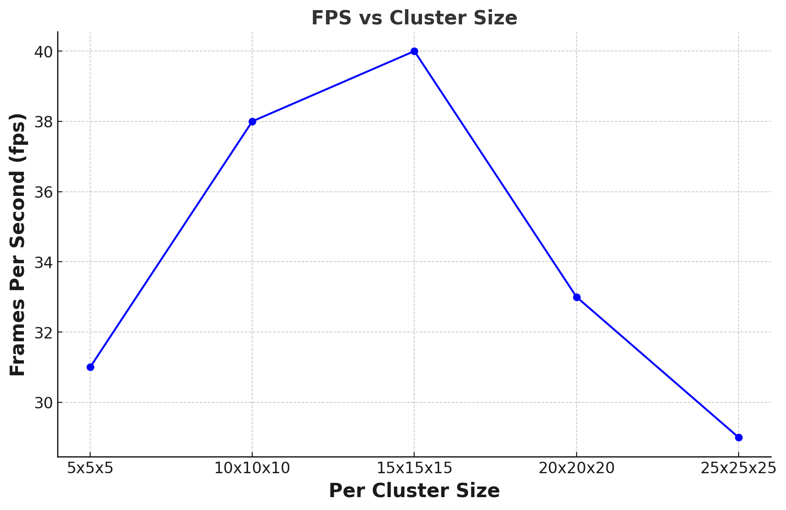
</div>

It's important to clarify that the "cluster size" refers to the dimensions of each cluster, not the count of clusters per dimension. The total count of clusters is determined by dividing the screen size by the cluster size, as shown in the formula:

```c++
int totalClustersX = canvas.width / clusterSize.x;
int totalClustersY = canvas.height / clusterSize.y;
int totalClustersZ = (farClip - nearClip) / clusterSize.z;
int totalClusters = totalClustersX * totalClustersY * totalClustersZ;
```

The relationship between the performance of the optimized clustered deferred rendering pipeline and the cluster size exhibits a non-linear trend. As the cluster size grows, the fps initially improves, peaking at a **15x15x15** configuration. Beyond this point, fps starts to decline. This behavior can be attributed to the trade-off involved: a larger cluster size implies fewer clusters to process, but also means more lights must be processed within each cluster. The overhead of handling more lights within a cluster could negate the benefits of processing fewer clusters, leading to a decline in fps.

---

### Varying Maximum Lights per Cluster

In my analysis, I also delved into the impact of varying the maximum number of lights per cluster. For this particular investigation, I utilized the optimized clustered deferred rendering pipeline. I configured the setup with a total of 15x15x15 clusters, while maintaining a constant count of 5000 lights. The graphical results of this experiment are presented below:

<div align='center'>
  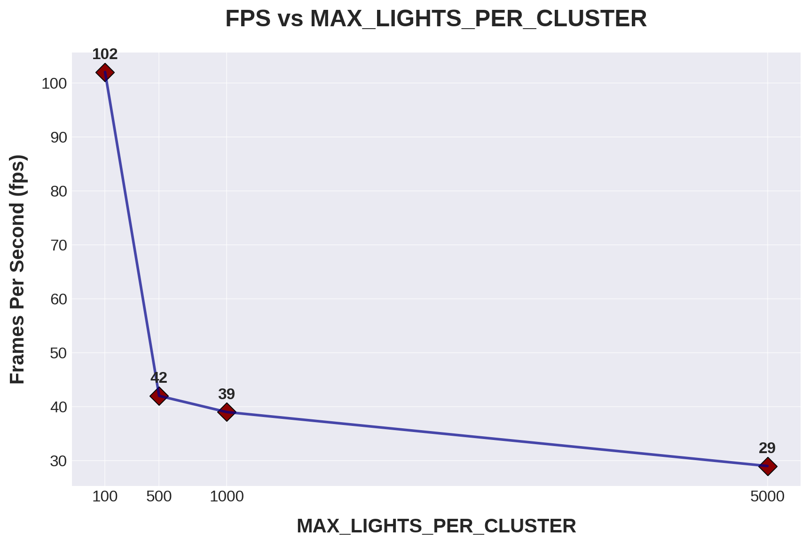
</div>

The trend illustrated by the graph clearly indicates a decrease in frames per second (fps) as the maximum number of lights per cluster is increased. This is attributed to the increased computational load on each cluster, resulting from the need to process a larger number of lights.


---

## Bloopers

Throughout the course of the project, I ventured into the realm of post-process effects, specifically attempting to implement a bloom blur effect on the rendered scene. My initial approach was to render the scene onto a texture, planning to utilize this scene texture for post-processing at a later stage. However, this endeavor met with challenges; I consistently encountered `gl.drawArray()` errors within the `renderFullscreenQuad()` function when attempting to render to `sceneTexture`.

Despite extensive debugging efforts, the root cause of the issue remained elusive. Ultimately, I made the decision to pivot away from this approach, opting instead to render the scene directly onto the canvas. It is worth noting that the code for the post-process bloom effect, located at `src/renderers/clusteredDeferredBloom.js`, remains within the repository, though it was not incorporated into the final iteration of the project.

---


## Credits

* [Three.js](https://github.com/mrdoob/three.js) by [@mrdoob](https://github.com/mrdoob) and contributors
* [stats.js](https://github.com/mrdoob/stats.js) by [@mrdoob](https://github.com/mrdoob) and contributors
* [webgl-debug](https://github.com/KhronosGroup/WebGLDeveloperTools) by Khronos Group Inc.
* [glMatrix](https://github.com/toji/gl-matrix) by [@toji](https://github.com/toji) and contributors
* [minimal-gltf-loader](https://github.com/shrekshao/minimal-gltf-loader) by [@shrekshao](https://github.com/shrekshao)
